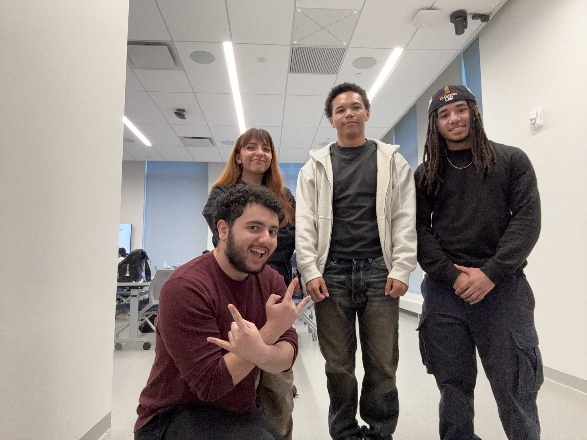

# TEAM 4

## App name

Setter Social

## Team members

- Narumi Aguirre-Kanashiro (Developer, Scrum Master, QA Tester)
- Michael DePaolo (Developer, Content Manager, QA Tester)
- Dante Hurr (Developer, Product Owner, QA Tester)
- Ayden Rodriguez (Developer, Documentation Manager, QA Tester)

## App description

SetterSocial was created by a team of students at Pace University as part of a semester-long course project. The intention behind SetterSocial is to help bring university students together, in real life. With the use of social media and AI tools, SetterSocial aims to narrow the gap between university students and their unfound community.

## Idea Proposal
[View on Google Docs](https://docs.google.com/document/d/1E_Oy8bg0Y2sVYaKFZ3GKhS7G9ZgsDuDN/edit)

## Calendar
[Calendar](https://calendar.google.com/calendar/u/0?cid=aXZoMmU3NjhzMjRkdGlxZWYwcXZvbzhxcjBAZ3JvdXAuY2FsZW5kYXIuZ29vZ2xlLmNvbQ)

## Product Backlog
[Requirements Discovery](https://docs.google.com/document/d/16sWuHpuVZluOQdeZk2iXl42V6YaDWeHQfn3sB3lvnDM/edit?usp=sharing)

[Product Backlog](https://docs.google.com/spreadsheets/d/13R0Cm3azh8C6I4ZdDoIX3NGR2KjCGCo3qCF6qDjTQdI/edit?gid=8#gid=8)

[Requirements Validation](https://docs.google.com/document/d/1hbdF4vAeB3ECj7bzoVw4tQ9REHw7zp1r/edit?usp=sharing&ouid=106405741471780344102&rtpof=true&sd=true)

## Architecture & Design
[Architecture & Design](https://www.figma.com/files/team/1095467798080641518/project/282219962/CS-491-Team-4?fuid=1091391913002178406)

## Process

### Sprint 1

* [Sprint planning](https://docs.google.com/document/d/1KzwiYCMULmUyLwMTRf4Li1EbIVHiYqqUJcZLqMJv0mY/edit?tab=t.0)
* [Scrums](https://docs.google.com/document/d/1cmUkc2Q8SQszo7vuiLeh7Bt3gz8dEKSbK2-QwbStg0c/edit?tab=t.0)
* [Sprint demo video](https://drive.google.com/file/d/1YKBHamsMWY7ADXdNxwTsSF3e-xa_ADdJ/view?usp=drive_link)
* [Sprint retrospective](https://docs.google.com/document/d/1frc1RmsTgVKcCY87TGRVPh3Lrnwd4YBzEPfP_ZwckRY/edit?usp=share_link)

### Sprint 2

* [Sprint planning](https://docs.google.com/document/d/1empVjAJck_5d-XiLiNPSVZpvhQ8qgCyewp3ks6fR-3Y/edit?usp=sharing)
* [Scrums](https://docs.google.com/document/d/1HFyZtkPKbQP7dTMa1il7w0hZA2aWYlO_SecfGEN4yTs/edit?usp=share_link)
* [Sprint demo video]()
* [Sprint retrospective](https://docs.google.com/document/d/1CCRe7hW0iM1caKDsK5rdHyQmmDnx0X_kxBzn6dqPvnc/edit?usp=sharing)

### Sprint 3

* [Sprint planning]()
* [Scrums]()
* [Sprint demo video]()
* [Sprint retrospective]()

## Tools & APIs

## Final delivery

* [Final presentation]()
* [Poster]()
* [Process description]()

